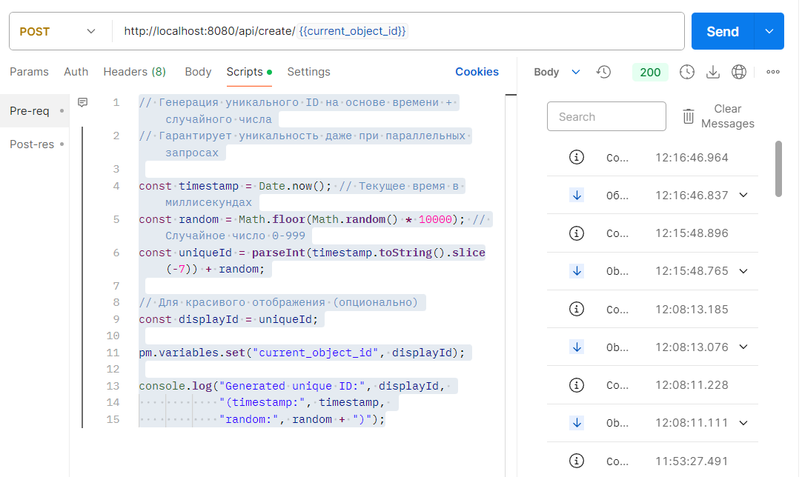

# Spring Event Example

Реактивное Spring Boot приложение с обработкой событий, WebFlux и PostgreSQL.

## 🚀 Технологии

- **Spring Boot 3.5.9**
- **Kotlin 1.9.25**
- **WebFlux** (реактивный стек)
- **R2DBC** (реактивный доступ к БД)
- **PostgreSQL 18**
- **Docker & Docker Compose**
- **Flyway/Liquibase** (миграции БД)

## 📁 Структура проекта

spring-event-example/  
├── src/main/kotlin/ru/kotlin/springeventexample/  
│ ├── config/ # Конфигурационные классы  
│ ├── controller/ # REST контроллеры  
│ ├── service/ # Сервисы (Business, Audit, SMS)  
│ ├── repository/ # Репозитории R2DBC  
│ ├── entity/ # Сущности БД  
│ └── event/ # Классы событий  
├── src/main/resources/  
│ ├── application.yml # Конфигурация  
│ └── db/migration/ # Миграции БД  
├── docker-compose.yml # Докер компоуз  
├── build.gradle.kts # Зависимости  
└── README.md # Этот файл

## 🛠️ Установка и запуск

### 1. Клонирование репозитория

```bash
git clone https://github.com/test80git/spring-event-example.git
cd spring-event-example
```

2. Запуск PostgreSQL через Docker
   bash
   docker-compose up -d
3. Запуск приложения
   bash
   ./gradlew bootRun
4. Доступ к приложению
   Приложение: http://localhost:8080

API Документация: http://localhost:8080/swagger-ui.html (если есть)

Actuator: http://localhost:8080/actuator/health

PgAdmin: http://localhost:8081 (логин: admin@admin.com / admin)

📊 API Endpoints  
Метод URL Описание  
POST /api/create/{id} Создать объект  
PUT /api/update/{id} Обновить объект  
DELETE /api/delete/{id} Удалить объект  
GET /api/events/stream SSE поток событий  
GET /api/sms/stream SSE поток SMS событий

📈 Архитектура  
Приложение использует реактивную архитектуру:  
Событийная модель через Spring Events  
Асинхронная обработка через WebFlux  
Реактивный доступ к БД через R2DBC  
Backpressure управление через Reactor

🔧 Конфигурация  
Основные настройки в application.yml:  
Порт сервера  
Настройки подключения к БД  
Параметры пула потоков  
Настройки логирования

🤝 Вклад в проект  
Форкните репозиторий  
Создайте ветку для фичи (git checkout -b feature/amazing-feature)  
Сделайте коммит (git commit -m 'Add amazing feature')  
Запушьте в ветку (git push origin feature/amazing-feature)  
Откройте Pull Request

📝 Лицензия
MIT License - смотрите файл LICENSE

# Postman

POST http://localhost:8080/api/create/{{current_object_id}}
Scripts:
Pre-req:

```js
// Генерация уникального ID на основе времени + случайного числа
// Гарантирует уникальность даже при параллельных запросах

const timestamp = Date.now(); // Текущее время в миллисекундах
const random = Math.floor(Math.random() * 10000); // Случайное число 0-999
const uniqueId = parseInt(timestamp.toString().slice(-7)) + random;

// Для красивого отображения (опционально)
const displayId = uniqueId;

pm.variables.set("current_object_id", displayId);

console.log("Generated unique ID:", displayId,
    "(timestamp:", timestamp,
    "random:", random + ")");
```



# pgadmin

Настройки

```bash
# Убедитесь что контейнеры запущены
docker-compose up -d

# Проверьте статус
docker-compose ps

# Должно быть примерно:
# NAME                COMMAND                  SERVICE             STATUS              PORTS
# audit-postgres      "docker-entrypoint.s…"   postgres            running             0.0.0.0:5435->5432/tcp
# audit-pgadmin       "/entrypoint.sh"        pgadmin             running             0.0.0.0:8081->80/tcp
```

2. Откройте PgAdmin в браузере:
   Перейдите по адресу: http://localhost:8081

Логин: admin@insurance.com
Пароль: admin

3. Подключитесь к PostgreSQL:
   Шаг 1: Добавьте новый сервер
   На главной странице PgAdmin нажмите "Add New Server"

Заполните данные:

Во вкладке General:
Name: Audit PostgreSQL (любое удобное имя)

Во вкладке Connection:
Параметр Значение Объяснение
Host name/address audit-postgres или postgres Имя сервиса из docker-compose (внутри сети Docker)
Port 5432 Порт PostgreSQL внутри Docker сети
Maintenance database audit_db Имя БД из docker-compose
Username postgres Пользователь из docker-compose
Password password Пароль из docker-compose
Save password? ✅ Да Чтобы не вводить каждый раз
Важно: Используйте audit-postgres (имя контейнера) как хост, потому что контейнеры находятся в одной Docker сети.

Шаг 2: Нажмите "Save"

4. Альтернативные варианты подключения:
   Вариант A: Если хотите подключаться с хоста (не из браузера):
   Параметр Значение
   Host localhost или 127.0.0.1
   Port 5435 (порт на хосте)
   Database audit_db
   Username postgres
   Password password

5. Проверка подключения:
   В PgAdmin после подключения:
   Раскройте сервер "Audit PostgreSQL" в левом дереве

Раскройте "Databases" → "audit_db"

Раскройте "Schemas" → "public" → "Tables"

Должны увидеть ваши таблицы (audit_logs, sms_logs и т.д.)

SQL запрос для проверки:

```sql
-- Проверка подключения
SELECT version();

-- Список всех баз данных
SELECT datname
FROM pg_database;

-- Список таблиц в текущей БД
SELECT table_name
FROM information_schema.tables
WHERE table_schema = 'public'
ORDER BY table_name;

-- Проверка таблицы audit_logs
SELECT *
FROM audit_logs LIMIT 10;

```
---
6. Если подключение не работает:
   Проверка 1: Убедитесь что контейнеры запущены

```bash
# Проверьте логи PostgreSQL
docker logs audit-postgres

# Проверьте логи PgAdmin
docker logs audit-pgadmin

# Проверьте сеть
docker network inspect project_audit-network
```

Проверка 2: Проверьте доступность PostgreSQL

```bash
# Подключитесь к контейнеру PostgreSQL
docker exec -it audit-postgres bash

# Внутри контейнера проверьте
psql -U postgres -d audit_db -c "\l"

# Или просто проверьте доступность
pg_isready -U postgres -h localhost -p 5432
```

Проверка 3: Проблема с сетью Docker
Если PgAdmin не видит PostgreSQL, возможно проблема с сетью:

```bash
# Пересоздайте сеть
docker-compose down
docker network prune
docker-compose up -d
```

Или используйте прямой IP:

```bash
# Узнайте IP адрес контейнера PostgreSQL
docker inspect -f '{{range .NetworkSettings.Networks}}{{.IPAddress}}{{end}}' audit-postgres
# Вернет что-то вроде: 172.20.0.2
```

В PgAdmin используйте этот IP как Host.

7. Улучшенный docker-compose.yml (с фиксами):
```bash
version: '3.8'

services:
  postgres:
    image: postgres:18
    container_name: audit-postgres
    hostname: postgres  # ← Добавьте hostname
    environment:
      POSTGRES_DB: audit_db
      POSTGRES_USER: postgres
      POSTGRES_PASSWORD: password
    ports:
      - "5435:5432"  # 5435 на хосте → 5432 в контейнере
    volumes:
      - postgres_data:/var/lib/postgresql
    networks:
      audit-network:
        aliases:
          - postgres  # ← Добавьте alias
    healthcheck:
      test: ["CMD-SHELL", "pg_isready -U postgres"]
      interval: 10s
      timeout: 5s
      retries: 5
    restart: unless-stopped

  pgadmin:
    image: dpage/pgadmin4:latest
    container_name: audit-pgadmin
    environment:
      PGADMIN_DEFAULT_EMAIL: admin@insurance.com
      PGADMIN_DEFAULT_PASSWORD: admin
      PGADMIN_CONFIG_SERVER_MODE: 'False'
      PGADMIN_CONFIG_MASTER_PASSWORD_REQUIRED: 'False'
    ports:
      - "8081:80"
    volumes:
      - pgadmin_data:/var/lib/pgadmin  # Сохраняем данные PgAdmin
    depends_on:
      postgres:
        condition: service_healthy  # Ждем пока PostgreSQL станет healthy
    networks:
      - audit-network
    restart: unless-stopped

volumes:
  postgres_data:
  pgadmin_data:

networks:
  audit-network:
    driver: bridge
```